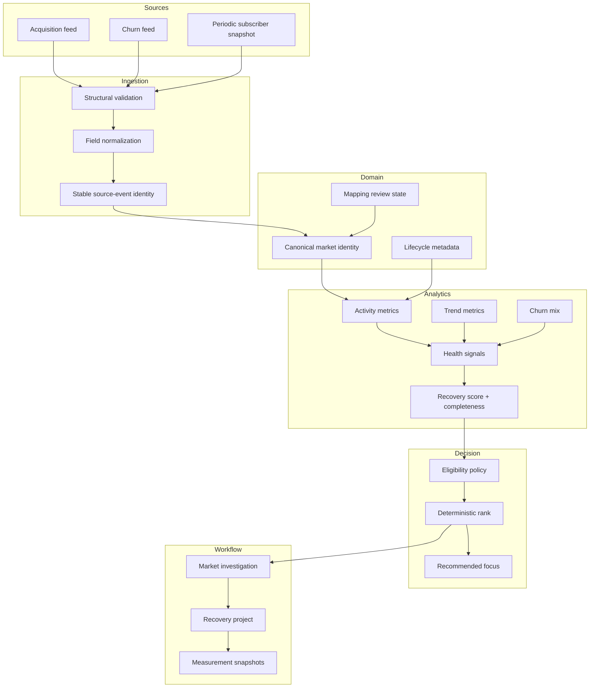

# Architecture

## Goal

The platform is a decision-support system, not a single scoring query.

It answers four distinct technical questions:

1. **Evidence:** what events and snapshots exist?
2. **Identity:** which records belong to the same analytical market?
3. **Inference:** what do the normalized metrics imply?
4. **Action:** should an operator start, continue, or withhold recovery work?

The public documentation uses neutral object names. These are **not production schema identifiers**.

## Layered model



## Separation of concerns

### 1. Source evidence

Raw inputs are treated as evidence, not analytics. Their responsibilities end at:

- structural validation
- source-specific parsing
- normalization
- source classification
- idempotent persistence

The ingestion layer should not decide whether a market is strategically important.

### 2. Canonical identity

Analytics are only meaningful after different source representations are resolved to the same domain entity.

A canonical market record owns:

- stable identity
- display metadata
- lifecycle state
- mappings from source systems
- mapping confidence/review status

Non-exact mappings are not silently forced. Ambiguity is retained as state.

### 3. Derived analytics

The analytical layer creates reusable facts such as:

- activity volumes over multiple horizons
- net acquisition
- churn composition
- subscriber trend direction
- trend acceleration
- recoverability context
- data completeness
- source reconciliation diagnostics

These values are computed once and reused by investigation and recommendation flows.

### 4. Score

The score is a severity model, not a project command.

Output is conceptually:

```ts
type ScoreResult = {
  score: number | null;
  completeness: number;
  signals: SignalResult[];
};
```

A score result must explain both **severity** and **coverage**.

### 5. Eligibility and ranking

The policy layer takes analytical output and operational state as separate inputs:

```text
score
+ data quality
+ lifecycle
+ active work
+ review/hold state
= eligibility
```

Only after eligibility is determined does deterministic ranking run.

### 6. Recovery workflow

The workflow persists operational intent separately from analytics.

This is important because:

- a market can remain analytically distressed while already being worked
- a project can continue after its original recommendation rank changes
- historical comparisons require frozen reference points
- analytical formulas can evolve without rewriting historical workflow events

## Server read path

For expensive analytical pages, the preferred request pattern is:

```text
route
  ↓
shared server loader
  ├─ canonical metrics/score read
  ├─ project-state read
  └─ lifecycle/data-quality read
  ↓
domain classification
  ↓
view model
  ↓
UI
```

The route should not independently request several overlapping analytical views when one canonical read can supply the same underlying evidence.

## Write path

Critical workflow transitions are revalidated at write time.

```text
browser intent
  ↓
server action / RPC boundary
  ↓
re-read current candidate + project state
  ↓
validate transition
  ↓
transaction
  ├─ create/update recovery project
  └─ freeze measurement snapshot
  ↓
commit
```

This protects against stale browser state and partial project creation.

## Historical measurement

Snapshots are append-oriented.

The public model recognizes:

- baseline
- periodic measurement
- review
- completion
- rebaseline after a justified identity/data correction

A rebaseline does not erase the original baseline. The system preserves both historical truth and a current comparison anchor.
