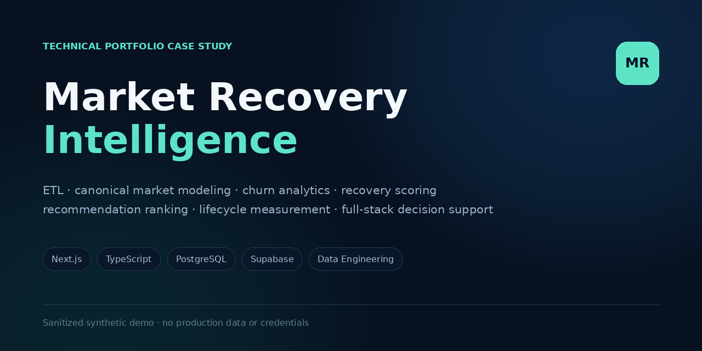
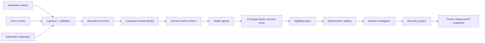

# Market Recovery Intelligence



**Public technical case study for a full-stack market recovery decision-support platform.**

[Live interactive demo](https://kaseypelchy-ops.github.io/market-recovery-platform-showcase/)

> This repository is a sanitized reconstruction. All market names, metrics, examples, identifiers, and code samples are synthetic or public abstractions. It contains no production data, credentials, customer records, or exact private scoring rules.

## What the system does

The underlying system answers a sequence of operational questions:

1. What changed in a market?
2. Are the source records describing the same geographic entity?
3. Is the change persistent or temporary?
4. What signals are driving the decline?
5. Is the market actionable now?
6. What intervention should be prioritized?
7. Did the intervention improve the market?

The design deliberately separates **evidence**, **identity**, **analytics**, **severity**, **eligibility**, and **measurement** so that one layer cannot silently redefine another.



## Technical scope

This case study demonstrates patterns used across the application:

- **Next.js + TypeScript** for the application and server-rendered investigation workflow
- **PostgreSQL / Supabase** for normalized data, analytical views, transactional writes, and access control
- **CSV/XLSX ingestion** with structural validation and stable deduplication
- **Canonical identity resolution** before analytics
- **Multi-horizon trend analysis** and churn classification
- **Coverage-aware weighted scoring** that does not treat missing data as healthy
- **Eligibility as a separate policy layer** from analytical severity
- **Deterministic recommendation ranking**
- **Transactional project transitions** with write-time revalidation
- **Immutable baseline snapshots** plus explicit rebaseline semantics
- **Read-path optimization** for expensive analytical pages
- **Shared domain/data modules** to prevent duplicated business logic

## Public reference architecture

The public repository uses neutral aliases rather than production schema names.

| Layer | Public abstraction | Responsibility |
|---|---|---|
| Ingestion | `ingestion_service` | Validate source shape, normalize fields, generate dedupe keys |
| Evidence | `acquisition_events`, `churn_events`, `subscriber_snapshots` | Durable normalized source evidence |
| Identity | `market_identity` | Resolve source geography into one canonical analytical entity |
| Metrics | `market_metrics_view` | Aggregate activity, trends, churn mix, penetration context |
| Signals | `health_signal_view` | Convert metrics into comparable analytical signals |
| Scoring | `recovery_score_view` | Produce severity plus data-completeness metadata |
| Policy | `eligibility_policy` | Apply lifecycle, data-quality, and active-work constraints |
| Ranking | `recommendation_engine` | Sort eligible markets deterministically |
| Workflow | `recovery_projects` | Track selected interventions and state transitions |
| Measurement | `project_snapshots` | Freeze baseline, review, and outcome states |

## Example: coverage-aware scoring

The public example keeps weights and cutoffs configurable rather than reproducing private values.

```ts
type WeightedSignal = {
  value: number | null;
  weight: number;
};

function normalizedWeightedScore(signals: WeightedSignal[]) {
  const available = signals.filter((signal) => signal.value !== null);

  const availableWeight = available.reduce(
    (sum, signal) => sum + signal.weight,
    0,
  );

  if (availableWeight === 0) return null;

  const weightedTotal = available.reduce(
    (sum, signal) => sum + signal.value! * signal.weight,
    0,
  );

  return weightedTotal / availableWeight;
}
```

The important design property is the denominator: **unavailable evidence is removed from available weight rather than silently contributing a zero severity score**.

See [`examples/scoring-engine.ts`](examples/scoring-engine.ts) for a fuller reference implementation.

## Example: severity is not eligibility

A market can have a high analytical score and still be excluded from action:

```ts
const eligible =
  score.isUsable &&
  market.lifecycle === "active" &&
  !projectState.hasConflictingWork &&
  !projectState.isInReviewHold;
```

This prevents the recommendation layer from conflating *how distressed a market is* with *whether a new action is currently allowed*.

See [`examples/recommendation-engine.ts`](examples/recommendation-engine.ts).

## Performance engineering case study

A key engineering issue was cold-page latency on analytical screens. The expensive path could evaluate overlapping derived logic multiple times during one request.

### Failure pattern

```text
page request
  ├─ score read
  ├─ classification read
  ├─ recommendation read
  └─ next-candidate read
        ↓
  overlapping analytical work
        ↓
  repeated scans / repeated derived calculations
```

### Refactored path

```text
page request
  ↓
shared server-side loader
  ├─ one canonical analytical read
  ├─ lightweight project-state read
  └─ lightweight lifecycle/data-quality read
        ↓
application-layer classification + ranking
        ↓
render
```

The optimization strategy was architectural rather than timeout-based:

- eliminate duplicate analytical reads
- bound rolling event scans to the necessary analysis horizon
- add indexes that match date/entity access patterns
- centralize shared loaders
- keep materialization/precomputation as the next scale step if cold reads become expensive again

See [`docs/PERFORMANCE_ENGINEERING.md`](docs/PERFORMANCE_ENGINEERING.md).

## Repository deep dive

- [`docs/ARCHITECTURE.md`](docs/ARCHITECTURE.md) — domain boundaries and request/data flow
- [`docs/DATA_PIPELINE.md`](docs/DATA_PIPELINE.md) — ingestion, normalization, idempotency, and identity resolution
- [`docs/SCORING_AND_ELIGIBILITY.md`](docs/SCORING_AND_ELIGIBILITY.md) — score completeness, policy separation, and deterministic ranking
- [`docs/PERFORMANCE_ENGINEERING.md`](docs/PERFORMANCE_ENGINEERING.md) — read-path failure mode and optimization strategy
- [`docs/VALIDATION_STRATEGY.md`](docs/VALIDATION_STRATEGY.md) — contract, build, browser, and data-quality validation
- [`docs/ENGINEERING_DECISIONS.md`](docs/ENGINEERING_DECISIONS.md) — ADR-style design decisions and tradeoffs
- [`docs/PUBLIC_BOUNDARY.md`](docs/PUBLIC_BOUNDARY.md) — what is deliberately abstracted from the public case study
- [`examples/`](examples/) — synthetic TypeScript and SQL reference patterns

## Interactive demo

The static GitHub Pages demo reconstructs a market investigation workspace using fictional scenarios. It demonstrates:

- recovery priority
- subscriber trajectory
- acquisition vs. churn
- churn-driver composition
- data completeness
- recommendation context
- lifecycle state
- action eligibility
- measurement workflow

No production API or database is called by the public demo.

## Repository structure

```text
.
├── index.html
├── styles.css
├── script.js
├── assets/
│   ├── architecture.svg
│   ├── data-model.svg
│   ├── favicon.svg
│   └── social-preview.png
├── docs/
│   ├── ARCHITECTURE.md
│   ├── DATA_PIPELINE.md
│   ├── SCORING_AND_ELIGIBILITY.md
│   ├── PERFORMANCE_ENGINEERING.md
│   ├── VALIDATION_STRATEGY.md
│   ├── ENGINEERING_DECISIONS.md
│   └── PUBLIC_BOUNDARY.md
├── examples/
│   ├── README.md
│   ├── domain-model.ts
│   ├── scoring-engine.ts
│   ├── recommendation-engine.ts
│   ├── read-path.sql
│   └── project-transition.sql
└── README.md
```

## Run locally

The public showcase has no runtime dependencies.

```bash
python -m http.server 8080
```

Then open:

```text
http://localhost:8080
```

GitHub Pages publishes directly from the `main` branch root.

## Disclosure boundary

The case study is intentionally representative rather than source-identical. It does **not** publish:

- customer or employee data
- real operational rankings
- production credentials, URLs, or identifiers
- raw source exports
- exact private scoring weights or cutoffs
- production object names
- internal pricing, margin, or commercial-performance data
- private operational notes

Technical depth is demonstrated through neutral aliases, synthetic data, diagrams, and representative code patterns instead of production implementation details.
