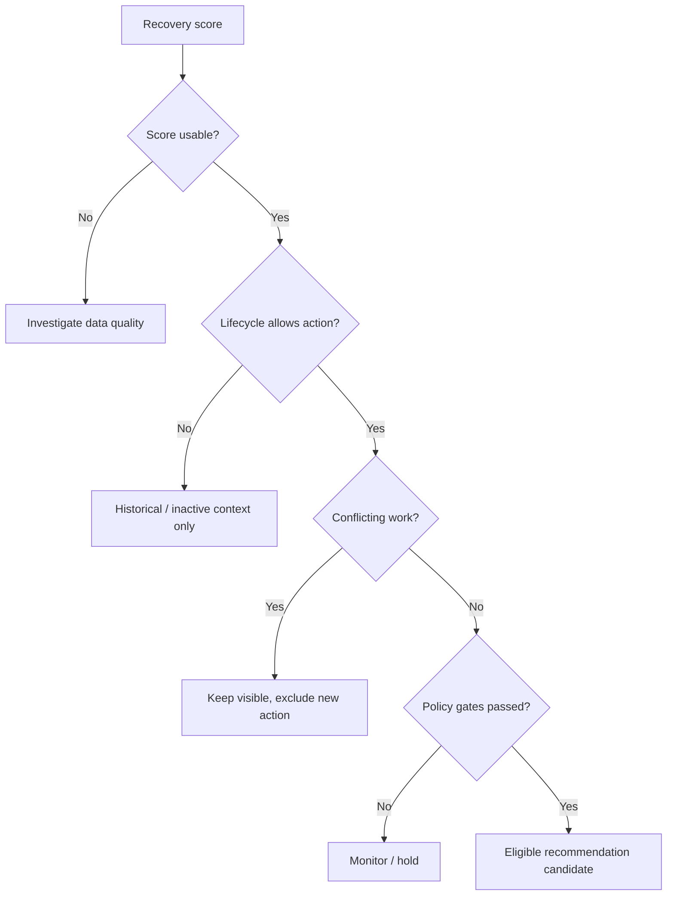
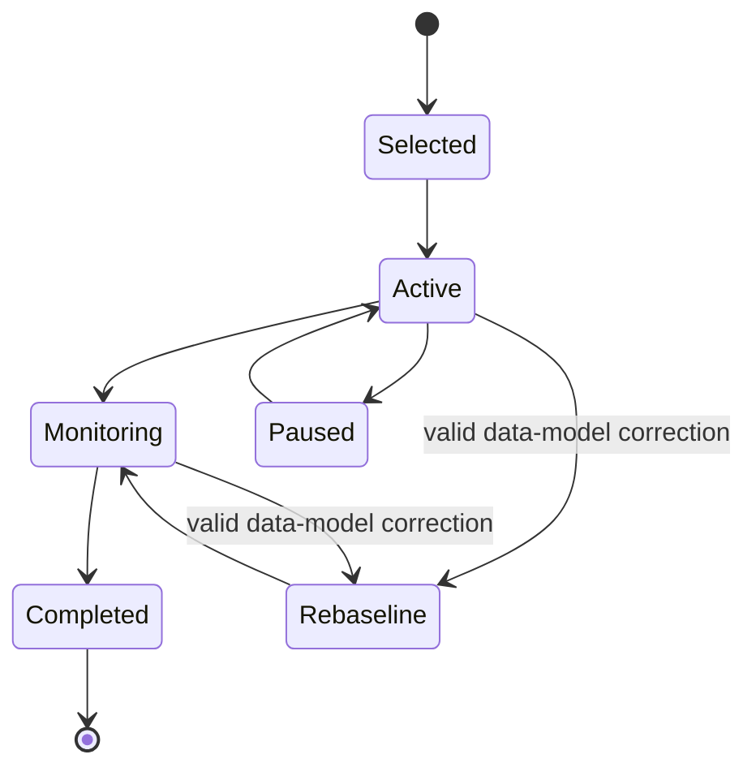
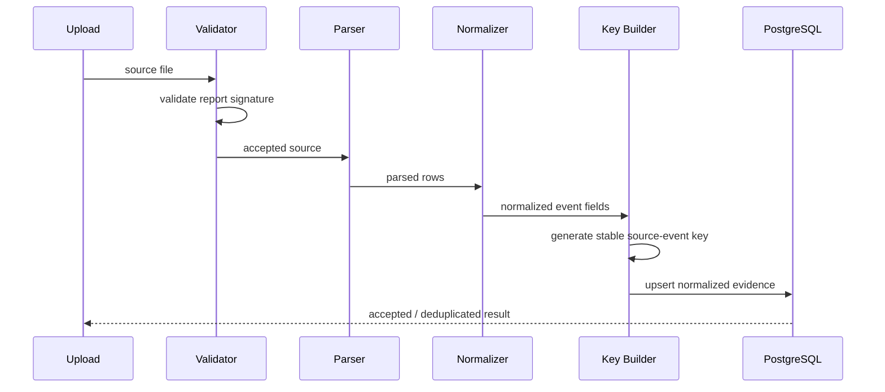
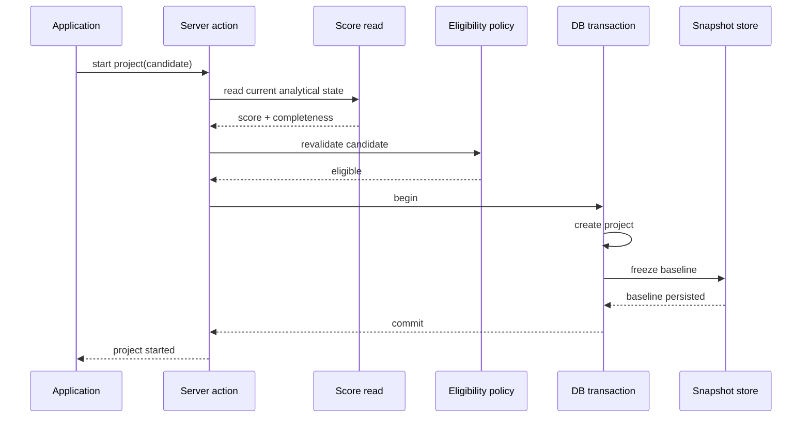
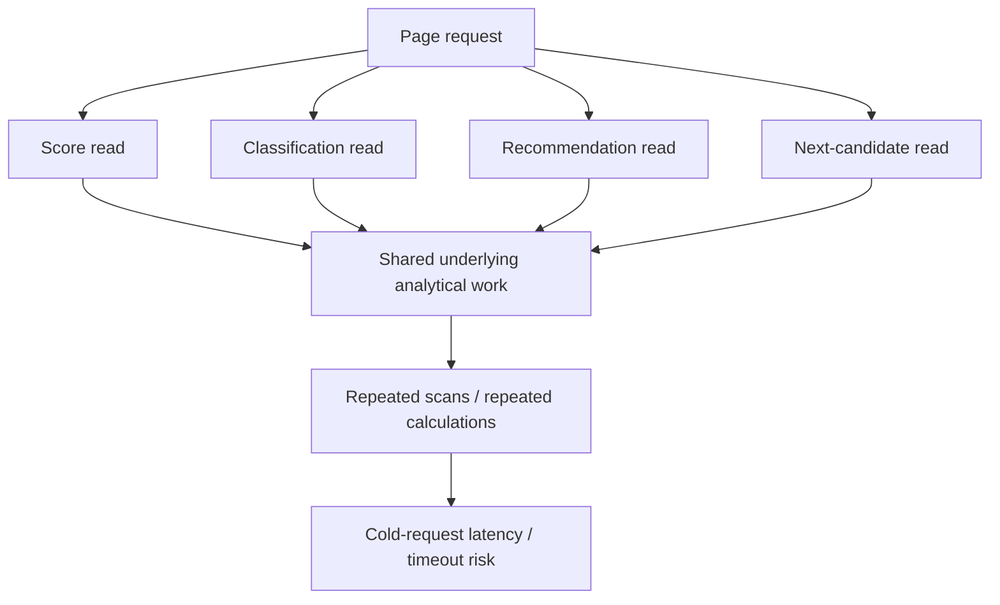
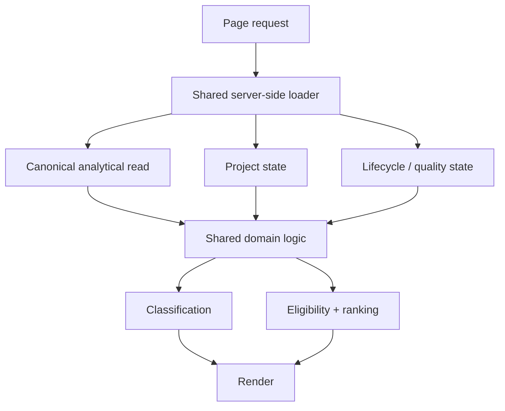

# Market Recovery Intelligence


**Public technical case study for a full-stack market recovery decision-support platform.**

[View the live interactive demo](https://kaseypelchy-ops.github.io/market-recovery-platform-showcase/)

> **Public-safe reconstruction:** all market names, metrics, examples, identifiers, and code samples in this repository are synthetic or intentionally abstracted. The repository does not contain production credentials, customer records, raw operational exports, or exact private scoring rules.

---

## Technical overview

The underlying application is a **Next.js / TypeScript decision-support system backed by PostgreSQL and Supabase**. It combines normalized operational events, subscriber history, canonical geographic identity, derived market-health metrics, coverage-aware scoring, policy-based eligibility, deterministic ranking, and recovery-project measurement.

The public GitHub Pages site is deliberately lighter-weight: it is a static HTML/CSS/JavaScript reconstruction that demonstrates the product and engineering model without connecting to production infrastructure.

| Area | Production architecture represented in this case study |
|---|---|
| Application | Next.js, React, TypeScript |
| Data platform | PostgreSQL, Supabase |
| Ingestion | CSV/XLSX parsing, schema validation, stable deduplication |
| Modeling | normalized event tables, canonical identity, analytical views |
| Analytics | rolling acquisition/churn, multi-horizon subscriber trends, signal derivation |
| Decision support | normalized scoring, completeness metadata, eligibility policy, ranking |
| Workflow | transactional project transitions and frozen measurement snapshots |
| Performance | bounded scans, targeted indexes, shared read paths |
| Validation | lint/build checks, browser regression, data-quality checks, migration discipline |

---

## System architecture

The central design principle is that **evidence, identity, analytics, severity, actionability, and measurement are separate layers**.

```mermaid
flowchart LR
    subgraph Sources["Operational source data"]
        A["Acquisition events"]
        B["Churn events"]
        C["Subscriber snapshots"]
    end

    subgraph Ingestion["Ingestion + normalization"]
        D["Schema validation"]
        E["Field normalization"]
        F["Stable dedupe keys"]
    end

    subgraph Canonical["Canonical analytical model"]
        G["Canonical market identity"]
        H["Derived market metrics"]
        I["Health signals"]
        J["Coverage-aware score"]
    end

    subgraph Decision["Decision policy"]
        K["Eligibility policy"]
        L["Deterministic ranking"]
        M["Market investigation"]
    end

    subgraph Measurement["Operational measurement"]
        N["Recovery project"]
        O["Frozen snapshots"]
        P["Outcome comparison"]
    end

    A --> D
    B --> D
    C --> D
    D --> E --> F --> G
    G --> H --> I --> J
    J --> K --> L --> M
    M --> N --> O --> P
```



The model intentionally avoids the common anti-pattern of putting ingestion rules, scoring logic, and workflow state into one dashboard query.

---

## Core engineering invariants

Several rules are treated as architectural invariants rather than UI behavior.

### 1. Canonical identity comes before analytics

Raw source systems can refer to the same geography differently. Metrics are therefore calculated only after source records have been resolved to a canonical analytical entity.

```text
raw source labels
      ↓
identity resolution
      ↓
canonical market
      ↓
metrics / signals / scoring
```

This prevents data from being grouped together merely because names look similar.

### 2. Missing evidence is not healthy evidence

A missing signal does not contribute a zero to the score. Instead, the score is normalized over the weight that is actually available.

For available signals \(i\):

```text
normalized_score
    = Σ(signal_i × weight_i)
      ──────────────────────
        Σ(available_weight_i)
```

Completeness is tracked independently:

```text
completeness
    = available_weight
      ────────────────
        total_weight
```

That separation allows the application to answer two different questions:

- **How severe does the available evidence look?**
- **How complete is the evidence behind that conclusion?**

Representative TypeScript:

```ts
export type WeightedSignal = {
  value: number | null;
  weight: number;
};

export function calculateNormalizedScore(signals: WeightedSignal[]) {
  const available = signals.filter(
    (signal): signal is WeightedSignal & { value: number } =>
      signal.value !== null,
  );

  const availableWeight = available.reduce(
    (sum, signal) => sum + signal.weight,
    0,
  );

  if (availableWeight === 0) {
    return {
      score: null,
      availableWeight: 0,
    };
  }

  const weightedTotal = available.reduce(
    (sum, signal) => sum + signal.value * signal.weight,
    0,
  );

  return {
    score: weightedTotal / availableWeight,
    availableWeight,
  };
}
```

A fuller synthetic implementation is available in [`examples/scoring-engine.ts`](examples/scoring-engine.ts).

### 3. Severity and eligibility are separate domains

A market may be analytically distressed and still be ineligible for a new intervention.



This prevents a numerical score from silently becoming workflow authorization.

Representative policy code:

```ts
const eligible =
  score.isUsable &&
  market.lifecycle === "active" &&
  !projectState.hasConflictingWork &&
  !projectState.isInReviewHold;
```

See [`examples/recommendation-engine.ts`](examples/recommendation-engine.ts).

### 4. Historical measurement is immutable

When a recovery project starts, its baseline is frozen. Later changes to source mapping or coverage do not rewrite the historical baseline.

A corrected measurement universe creates a new comparison anchor rather than mutating the original record.



The state diagram is representative and intentionally abstracts production-specific workflow details.

---

## Public reference data model

The repository uses neutral public aliases rather than production object names.

| Layer | Public abstraction | Responsibility |
|---|---|---|
| Ingestion | `ingestion_service` | validate source shape, normalize fields, create dedupe keys |
| Evidence | `acquisition_events` | durable acquisition evidence |
| Evidence | `churn_events` | durable churn evidence |
| Evidence | `subscriber_snapshots` | point-in-time subscriber observations |
| Identity | `market_identity` | canonical geographic identity |
| Metrics | `market_metrics_view` | aggregate rolling activity and subscriber trends |
| Signals | `health_signal_view` | transform metrics into comparable severity signals |
| Scoring | `recovery_score_view` | calculate severity plus completeness metadata |
| Policy | `eligibility_policy` | apply lifecycle, quality, and active-work constraints |
| Ranking | `recommendation_engine` | rank only eligible candidates |
| Workflow | `recovery_projects` | persist operational intervention state |
| Measurement | `project_snapshots` | freeze baseline, review, and outcome observations |

A visual version is available in [`assets/data-model.svg`](assets/data-model.svg).

---

## Data pipeline and idempotency

The ingestion layer is designed so that a historical file can be uploaded again without duplicating analytical evidence.



Key properties:

- structural validation happens before persistence
- parsing and normalization are deterministic
- dedupe identity is stable across re-uploads
- source identity is retained separately from canonical market identity
- ambiguous geographic matches can remain unresolved rather than being force-mapped

See [`docs/DATA_PIPELINE.md`](docs/DATA_PIPELINE.md).

---

## Recommendation path

The recommendation engine is intentionally deterministic.

At a high level:

```text
canonical metrics
      ↓
health signals
      ↓
coverage-aware severity score
      ↓
score usability
      ↓
lifecycle / project / policy gates
      ↓
eligible candidate set
      ↓
stable ranking
      ↓
recommended investigation target
```

A deterministic rank order matters because the same analytical state should produce the same recommendation regardless of page load, query order, or client state.

---

## Transactional project start

Starting a recovery project is more than inserting a row. The transition needs to revalidate the candidate at write time and freeze its baseline atomically.



The important property is **write-time revalidation**. A candidate that was eligible when the page loaded must still be eligible when the project is actually created.

See [`examples/project-transition.sql`](examples/project-transition.sql).

---

## Performance engineering

One of the most important engineering problems in the project was **cold analytical page latency**.

### Original read pattern

Multiple UI needs could independently request overlapping analytical objects:



### Refactored read path

The application was moved toward one canonical heavy read plus lightweight state reads:



The strategy was architectural rather than timeout-based:

- avoid repeated evaluation of the same analytical universe
- bound rolling event reads to required time horizons
- use indexes aligned with entity/date access patterns
- centralize shared server-side loaders
- keep materialized/precomputed scoring as a later scaling option if necessary

A representative query pattern is in [`examples/read-path.sql`](examples/read-path.sql). The complete public discussion is in [`docs/PERFORMANCE_ENGINEERING.md`](docs/PERFORMANCE_ENGINEERING.md).

---

## Shared application boundary

A second maintainability issue was duplicated domain logic inside large route files.

The improved design separates route orchestration from domain/data logic:

```text
route / page
    ↓
shared market-recovery layer
    ├── data loading
    ├── numeric normalization
    ├── classification
    ├── recommendation policy
    └── shared domain types
    ↓
presentation
```

This reduces the risk that the Dashboard and Market Investigation screens drift into separate implementations of the same rules.

---

## Validation strategy

The system is validated at several levels instead of relying on one test type.

| Layer | What is validated |
|---|---|
| Source contract | expected CSV/XLSX structure and report signature |
| Parsing | normalized dates, identifiers, classifications, dedupe keys |
| Persistence | idempotent writes and required constraints |
| Analytics | known signal/score cases and missing-data behavior |
| Policy | severity remains separate from action eligibility |
| Database | migrations, targeted indexes, rollback path |
| Application | TypeScript/build/lint correctness |
| Browser | real navigation and interactive regression |
| Public showcase | local asset paths, anchors, JS syntax, SVG validity |

The public validation notes are documented in [`docs/VALIDATION_STRATEGY.md`](docs/VALIDATION_STRATEGY.md).

---

## Interactive Market Investigation demo

The live site reconstructs the investigation experience using fictional market scenarios.

It demonstrates:

- subscriber trajectory
- recent acquisition vs. churn
- churn-driver composition
- multi-horizon trend context
- data completeness
- normalized recovery signals
- analytical severity
- policy-based eligibility
- recommendation context
- lifecycle behavior
- project measurement concepts

No production API or database is called by the public demo.

[Open the interactive demo](https://kaseypelchy-ops.github.io/market-recovery-platform-showcase/)

---

## Repository map

```text
.
├── index.html
├── styles.css
├── script.js
├── NOTICE.md
├── README.md
│
├── assets/
│   ├── architecture.svg
│   ├── data-model.svg
│   ├── favicon.svg
│   └── social-preview.png
│
├── docs/
│   ├── ARCHITECTURE.md
│   ├── DATA_PIPELINE.md
│   ├── ENGINEERING_DECISIONS.md
│   ├── PERFORMANCE_ENGINEERING.md
│   ├── PUBLIC_BOUNDARY.md
│   ├── SCORING_AND_ELIGIBILITY.md
│   └── VALIDATION_STRATEGY.md
│
└── examples/
    ├── README.md
    ├── domain-model.ts
    ├── scoring-engine.ts
    ├── recommendation-engine.ts
    ├── read-path.sql
    └── project-transition.sql
```

### Technical deep dives

- [`docs/ARCHITECTURE.md`](docs/ARCHITECTURE.md) — domain boundaries and request/data flow
- [`docs/DATA_PIPELINE.md`](docs/DATA_PIPELINE.md) — ingestion, normalization, idempotency, and identity resolution
- [`docs/SCORING_AND_ELIGIBILITY.md`](docs/SCORING_AND_ELIGIBILITY.md) — completeness, severity, policy separation, and ranking
- [`docs/PERFORMANCE_ENGINEERING.md`](docs/PERFORMANCE_ENGINEERING.md) — analytical read-path failure mode and optimization
- [`docs/VALIDATION_STRATEGY.md`](docs/VALIDATION_STRATEGY.md) — contract, build, browser, and data-quality validation
- [`docs/ENGINEERING_DECISIONS.md`](docs/ENGINEERING_DECISIONS.md) — ADR-style design decisions and tradeoffs
- [`docs/PUBLIC_BOUNDARY.md`](docs/PUBLIC_BOUNDARY.md) — public abstraction/sanitization boundary
- [`examples/`](examples/) — representative TypeScript and SQL patterns

---

## Run locally

The portfolio site has no runtime dependencies or build step.

```bash
python -m http.server 8080
```

Then open:

```text
http://localhost:8080
```

The static site expects these local paths:

```text
assets/favicon.svg
assets/architecture.svg
assets/data-model.svg
styles.css
script.js
```

GitHub Pages publishes directly from the `main` branch root.

---

## Public disclosure boundary

This repository demonstrates system design without publishing source-identical production implementation.

It does **not** include:

- customer or employee data
- production credentials, URLs, or project identifiers
- raw operational exports
- real market rankings
- exact private weights or cutoffs
- production-only object names
- confidential pricing, margin, or commercial-performance information
- private operational notes

The architecture, code samples, SQL examples, diagrams, and synthetic UI are designed to demonstrate the engineering approach while keeping production-specific details abstracted.

See [`docs/PUBLIC_BOUNDARY.md`](docs/PUBLIC_BOUNDARY.md).
